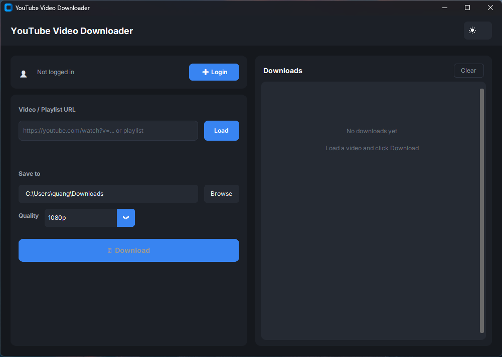
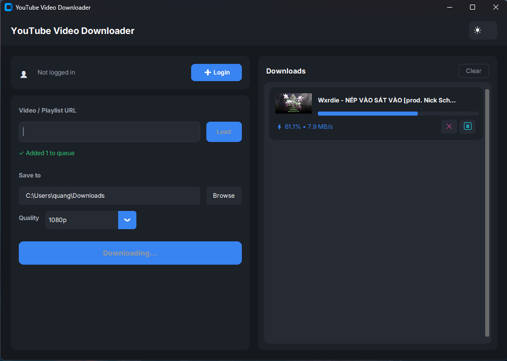
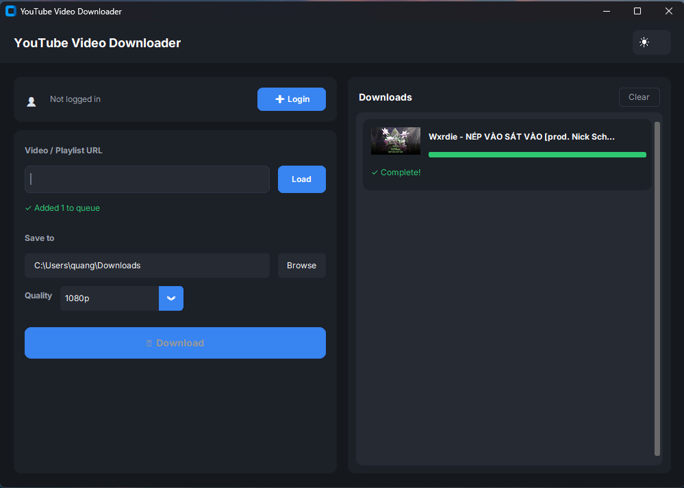

# YT Downloader

A modern, cross-platform YouTube video downloader with a beautiful dark-themed UI. Built with Python and CustomTkinter.


## ✨ Features

- 🎬 **Comprehensive Download Support** - Download YouTube videos, playlists, and member-only videos
- 🔐 **Login Methods** - Support **Login with Cookie** (Recommended) and **Login with Google**
- 📊 **Multiple Quality Options** - Choose from available video/audio qualities

## 📸 Screenshots

<p align="center">
  
</p>
<p align="center">
  
  
</p>

## 🚀 Installation

### Option 1: Download Pre-built Binary (Recommended)

Download the latest release for your platform from [Releases](../../releases):
- **Windows**: `YT-Downloader-Windows.exe`
- **macOS**: `YT-Downloader-macOS`
- **Linux**: `YT-Downloader-Linux`

### Option 2: Run from Source

```bash
# Clone the repository
git clone https://github.com/yourusername/yt-downloader.git
cd yt-downloader

# Install dependencies
pip install -r requirements.txt

# Run the app
python main.py
```

### Prerequisites

- Python 3.11 or higher
- [FFmpeg](https://ffmpeg.org/download.html) (for audio extraction and merging)

## 📖 Usage

### Basic Download

1. Paste a YouTube URL in the input field
2. Click **Load** to fetch video info
3. Select quality and format
4. Click **Download**

### Login for Member Content

1. Click **Login with Google**
2. A browser window will open for Google login
3. After logging in, cookies are automatically captured
4. Now you can download member-only videos!

### Playlist Downloads

1. Paste a playlist URL
2. All videos in the playlist will be queued
3. Downloads process one by one with progress tracking

## 🛠️ Tech Stack

- **GUI**: [CustomTkinter](https://github.com/TomSchimansky/CustomTkinter)
- **Download Engine**: [yt-dlp](https://github.com/yt-dlp/yt-dlp)
- **Browser Automation**: [Selenium](https://selenium-python.readthedocs.io/)
- **Build**: [PyInstaller](https://pyinstaller.org/)

## 📁 Project Structure

```
yt-downloader/
├── main.py                 # Entry point
├── app/
│   ├── app.py             # Main application
│   ├── core/
│   │   ├── auth.py        # Authentication manager
│   │   └── downloader.py  # yt-dlp wrapper
│   └── ui/
│       ├── theme.py       # Color themes
│       ├── main_window.py # Main window
│       ├── download_frame.py
│       ├── login_frame.py
│       └── progress_frame.py
├── requirements.txt
└── .github/workflows/
    └── release.yml        # CI/CD for releases
```

## 🔧 Building from Source

```bash
# Install PyInstaller
pip install pyinstaller

# Build executable
pyinstaller --noconfirm --onefile --windowed --name "yt-downloader" main.py
```

The executable will be in the `dist/` folder.

## 🤝 Contributing

Contributions are welcome! Please feel free to submit a Pull Request.

1. Fork the repository
2. Create your feature branch (`git checkout -b feature/amazing-feature`)
3. Commit your changes (`git commit -m 'Add amazing feature'`)
4. Push to the branch (`git push origin feature/amazing-feature`)
5. Open a Pull Request

## 📜 License

This project is licensed under the MIT License - see the [LICENSE](LICENSE) file for details.

## ⚠️ Disclaimer

This tool is for personal use only. Please respect YouTube's Terms of Service and copyright laws. Do not download content you don't have permission to download.

## 🙏 Acknowledgments

- [yt-dlp](https://github.com/yt-dlp/yt-dlp) - The amazing download engine
- [CustomTkinter](https://github.com/TomSchimansky/CustomTkinter) - Modern Tkinter widgets
- All contributors and users of this project

---

<p align="center">Made with ❤️ by the community</p>
